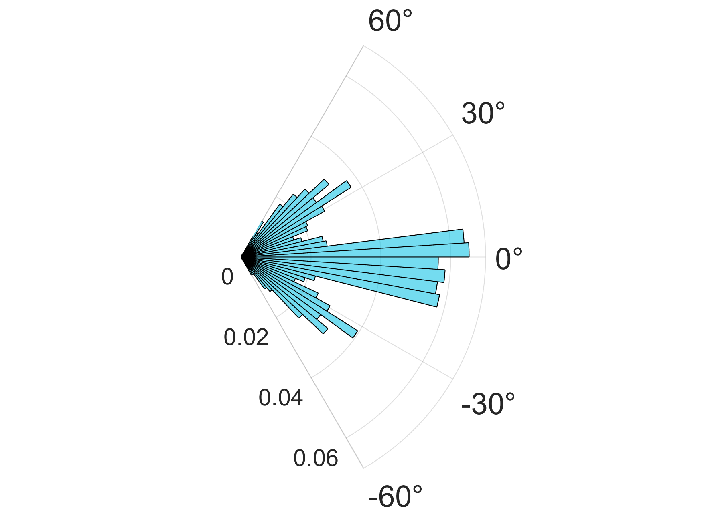

# Optitrack at the Wellcome Centre for Human Neuroimaging OP-MEG lab:
Scripts and SOPs for collecting, processing and plotting the Optitrack motion capture data


# Things this Repository can do:


### Load in optitrack data

This function can deal with rotation data in both quaternions and euler angles

```matlab
 opti_data = csv2mat_sm(motive_data);
```
### Convert optitrack data from mm to cm

```matlab
opti_data = optitrack_to_cm(opti_data);
```
### Synchronise and upsample the opti-track data to match the OP-MEG data

```matlab
%% Sync up opti-track and OP-MEG data
[MovementDataOut, OPMdataOut] = syncOptitrackAndOPMdata(opti_data,...
	rawData,'TriggerChannelName','FluxZ-A');
```

### Quick Data Plots

Plot the continuous rotations, translations and mean marker error

```matlab
% Plot the rotations
plot_motive_rotation(opti_data,'euler')
    
% Plot the translations
plot_motive_translation(opti_data,'euler')

% Plot mean marker error (Column 7 for euler data; 8 for quaternions)
figure;
plot(opti_data.time,opti_data.rigidbodies.data(:,7),'LineWidth',2);
ylabel('Mean Marker Error');xlabel('Time (s)');
```

### Fancy Translation Plots

```matlab
pos_data = MovementDataOut.rigidbodies.data(:,4:6)
cols = [100, 100, 250; 142 185 57; 198 61 61]./255;
```

Plot a histogram of translations (pos_data)

```matlab
% For X, Y, Z...
for c = 1:3
    % Use make_pos_hist
    make_pos_hist(pos_data(:,c),cols(c,:));
    
    % Change the Y ticks
    yt = get(gca, 'YTick');
    set(gca,'YTick',linspace(yt(1),yt(end),4));
    yt = get(gca, 'YTick');

    % Change X ticks
    norm_vals = round((yt/length(pos_data(:,c))),2);
    xt = get(gca, 'XTick');
    set(gca,'XTick',linspace(xt(1),xt(end),5));
    set(gca, 'YTick', yt, 'YTickLabel',norm_vals);
    
end
```

### Calculate Euclidian Distance and Plot

```matlab
%% Get euclidian distance from start point and plot
dist_from_start = pdist2(pos_data,pos_data(1,:));

% Plot the euclidian distance over time
figure;
set(gcf,'Position',[1 1 1200 600]);
m = dist_from_start(:,:);
p1 = plot(t,m,'LineWidth',2,'Color','k'); hold on;
p1.Color(4) = 0.8;
set(gca,'FontSize',18);
ylabel(['Euclidian Distane (cm)'],'FontSize',22);
xlabel('Time (s)','FontSize',22);
print('euclidian_distance_from_start','-dsvg','-r300');
```

### Fancy Rotation Plots

```matlab
deg_XYZ = MovementDataOut.rigidbodies.data(:,1:3)
cols = [235 210 0; 230 0 99; 23 196 230]/255;

% Make the first point 0 0 0
degXYZ = zero_optitrack_data(degXYZ);
```

Plot a histogram of rotations (deg_XYZ)

```matlab
%% Polar Histogram
% For X, Y, Z...
for c = 1:3
    figure; ax = polaraxes;
    h = polarhistogram(deg2rad(degXYZ(:,c)),50,...
        'Normalization','probability');
    thetalim([-60 60]);
    ax.FontSizeMode = 'manual'
    ax.FontSize = 18
    ax.RAxis.FontSize = 14;
    ax.ThetaTickLabel = {'-60°','-30°','0°','30°','60°'}
    
    h(1).FaceColor = cols(c,:);

    print(['polarhistogram' num2str(c)],'-dpng','-r300');
end
```


